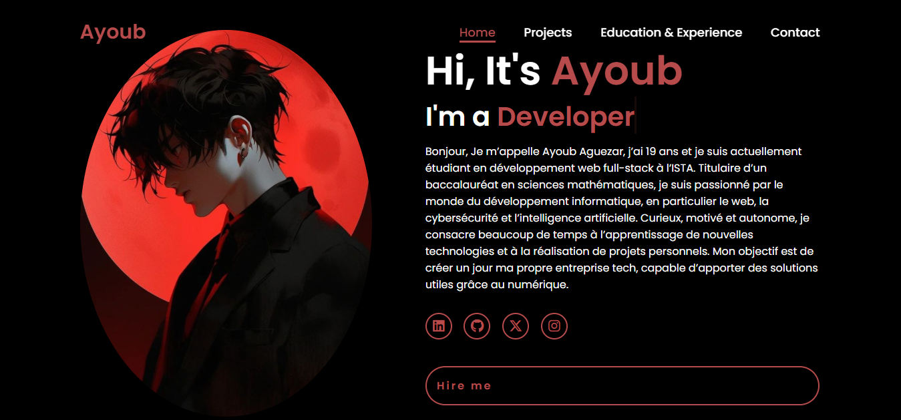

# 🌟 Portfolio - Ayoub Aguezar
---
<p align="center">
  
</p>


Bienvenue dans mon portfolio professionnel ! Ce projet présente mes compétences, mes projets web, mon parcours de formation ainsi que mes informations de contact.  
Il s'agit d'un site moderne, responsive et entièrement réalisé en **HTML, CSS, JavaScript**, avec une attention particulière au design et à l'expérience utilisateur.

---

## 🎨 Design & Identité Visuelle

### 🎨 Palette de Couleurs
- **Fond général** : Noir (`#000000`)
- **Couleur d’accent** : Rouge Bordeaux (`#b74b4b`)
- **Texte** : Blanc (`#ffffff`)

### ✒️ Typographie
- Police principale : **Poppins** (Google Fonts)
- Base : `62.5%` (équivalent 10px) facilitant le calcul en `rem`

### 🧩 Principes UI/UX
- Animation typewriter moderne
- Espacement cohérent
- Responsive design (mobile, tablette, desktop)
- Navigation fluide

---

## 📱 Structure du Site

### 🏠 1. Page d’Accueil (`index.html`)
- Photo professionnelle
- Animation texte machine à écrire
- Bouton **Hire me**
- Liens vers réseaux sociaux
- Présentation personnelle stylée

---

### 💼 2. Projets (`projet.html`)
Affichage clair et moderne de plusieurs projets :

#### 🔢 **Calculatrice Python**
- Programme console
- Fonctionnalités scientifiques
- Déploiement Netlify avec interface HTML

#### 🌐 **Portfolio Web**
- Le site que vous lisez actuellement
- UX moderne
- Responsive

#### 🎁 **Cadeau pour ma Mère**
- Petit site symbolique design
- Message personnel

#### 📋 **Task Manager**
- Application web simple de gestion des tâches
- HTML/CSS/JS

#### 🔗 **Nouveau Projet Ajouté**
👉 **https://gleaming-caramel-c3fadf.netlify.app/**  
Projet moderne déployé récemment s’intégrant dans mon parcours de développeur.

---

## 📚 Formations & Expériences (`formations.html`)

### 🧠 Compétences Techniques
- **Langues** : Arabe, Français, Amazigh, Anglais  
- **Développement Web** :
  - HTML5, CSS3, Bootstrap
  - JavaScript
  - PHP
  - Python
  - SQL / MySQL
- **Soft Skills** :
  - Communication
  - Discipline
  - Travail d’équipe
  - Résolution de problèmes

### 🎓 Parcours Éducatif
- **ISTA Maroc** — *Développement Web Full‑Stack*
- **FreeCodeCamp** — *Responsive Web Design*
- **The Odin Project** — *Full Stack JavaScript*
- **Baccalauréat Sciences Mathématiques**

---

## 📞 Page Contact (`contact.html`)
- Formulaire fonctionnel
- Validation front-end
- Champs :
  - Nom
  - Email
  - Message
- Intégration **FormSubmit**

---

## 🌐 Liens des Projets Déployés

| Projet | Lien |
|--------|------|
| Portfolio Principal | https://remarkable-bubblegum-7fbc1a.netlify.app/ |
| Calculatrice Python | https://bucolic-semifreddo-1ad3c5.netlify.app/ |
| Cadeau pour ma Mère | https://lively-sawine-97ce9a.netlify.app/ |
| Nouveau Projet | https://gleaming-caramel-c3fadf.netlify.app/ |

---

## 🚀 Installation & Utilisation

1. **Cloner le dépôt**
```bash
git clone https://github.com/votre-username/portfolio.git
```

2. **Ouvrir le projet**
```bash
cd portfolio
```

3. **Lancer dans un navigateur**
- Double‑clique sur `index.html`
- Ou utilise un serveur local comme Live Server (VS Code)

---

## 📦 Arborescence du Projet
```
.
├── index.html
├── projet.html
├── formations.html
├── contact.html
├── assets/
│   ├── css/
│   ├── js/
│   ├── images/
└── README.md
```

---

## 🤝 Contribution
Les contributions sont les bienvenues !  
Vous pouvez proposer :
- des améliorations UI
- des optimisations JS
- des corrections d'orthographe

---

## 🧑‍💻 Auteur
**Ayoub Aguezar**  
Développeur Web Full‑Stack en formation.

---

## ⭐ Support
Si vous aimez ce projet, pensez à laisser une ⭐ sur le repository GitHub !

